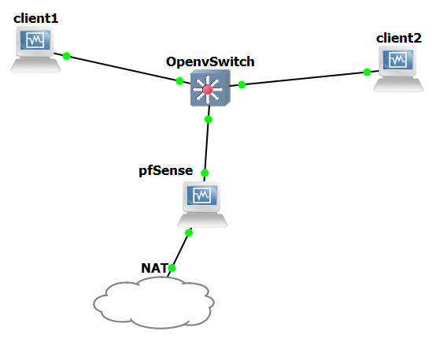

# Projet-InfraSI
  
 SSH hboueix@192.168.56.111 -D 7777 (port) + CONFIG sur firefox pour rediriger la navigation vers la VM client
 
## OS & Matériel :
 
 + Routeur pfSense 2.4.4
 + Machines clients CentOS 7 minimal
 + OpenVswitch
 
## Schéma 
  
<p align="center">
  
</p>
 
## Installation de pfSense

Tout d'abord :  
  
1) Démarrer la machine avec le support d'installation inseré
2) Laisser l'autoboot (par défaut)
3) Accepter: "Copyright & Distribution"
4) Selectionner: "Install pfSense"
5) Selectionner: "French keymap" & "Continue"
6) Partitioning: "Auto(UFS)"
7) Manual Config: "No"
8) Reboot et éjecter le support d'installation 
  

## Configuration basique de pfSense

Après le reboot on arrive donc sur l'écran de menu. On va effectuer une configuration basique pour l'instant, celle-ci nous permettra d'accèder à l'interface web d'administration.   
  
1) Option 1 : Assign Interfaces
    - Définir VLANs maintenant ? : "n"
    - Renseigner interface WAN (em0) et l'interface LAN (em1)
    - Valider : "y"
2) Option 2 : Set Interface(s) IP address
    - Selectionner l'interface WAN
    - DHCPv4 ? : "y"
    - DHCPv6 ? : "n"
    - <Enter> pour pas d'IPv6
    - Revert to HTTP ? : "n"
    - <Enter> pour continuer  
3) Option 2 : Set Interface(s) IP address
    - Select l'interface LAN
    - Entrez l'adresse IPV4 : 192.168.1.1
    - Entrez le masque au format CIDR : 24
    - <Enter> pour pas de gateway
    - <Enter> pour pas d'IPv6
    - DHCP server ? : "y"
    - Adress range : 192.168.1.10 - 192.168.1.150
    - Revert to HTTP ? "no"
    - <Enter> pour continuer
  
Nous pouvons désormais accèder à l'interface web d'administration depuis le LAN à l'adresse `192.168.1.1`.  
  
Lors de la première connexion, vous serez guider pour une première "configuration".

1) Suivre le setup
2) Général Information :
    - Renseigner hostname, domain et DNS
    - Laisser cocher "Override DNS"
3) Régler la localisation et l'heure
4) Configurer l'interface WAN
5) Configurer l'interface LAN
5) Modifier le mdp admin (qui est également le mdp de la machine root)
6) Reload & Finish  
  
Normalement avec le schéma et la configuration actuelle, toutes les machines devraient pouvoir se ping et accèder à Internet.  
  
De plus toutes les machines ont accès au serveur DNS du routeur, et ce dernier récupère les serveurs DNS du WAN (grâce à l'option "Override DNS").

## Configuration de VLANS

Il faut commencer par configurer les VLANS sur le routeur, depuis l'interface web d'administration :  
  
 "Interfaces" > "Assignment" > "VLANS"  
   
Créez une interface VLAN 10 et une VLAN 20 sur l'interface LAN. Associez leur respectivement l'adresse IP `192.168.10.254` et `192.168.20.254`.  
  
Ensuite cela se passe sur le switch, connectez vous à la console en telnet (généralement sur le port 5000 de la GNS3 VM). Il faut ajouter 2 ports "internes" associé à chacune de VLAN :  
```
/ # ovs-vsctl add-port br0 vlan10 tag=10 -- set interface vlan10 type=internal
/ # ovs-vsctl set port vlan10 vlan_mode=access
/ # ip addr add 192.168.10.1/24 brd + dev vlan10
/ # ip link set dev vlan10 up
/ #
/ # ovs-vsctl add-port br0 vlan20 tag=20 -- set interface vlan20 type=internal
/ # ovs-vsctl set port vlan20 vlan_mode=access
/ # ip addr add 192.168.20.1/24 brd + dev vlan20
/ # ip link set dev vlan20 up
```  
  
Associez également les interfaces physiques au VLANs :  
```
/ # ovs-vsctl set port eth0 trunks=10,20
/ # ovs-vsctl set port eth1 tag=10
/ # ovs-vsctl set port eth1 vlan_mode=access
/ # ovs-vsctl set port eth2 tag=20
/ # ovs-vsctl set port eth2 vlan_mode=access
```  
  
Il faut maintenant activer le DHCP sur les interfaces VLAN 10 et VLAN 20 sur le routeur. De retour sur l'interface d'administration :  
  
"Services" > "DHCP Server" > "OPT1"  
  
Activez le DHCP sur l'interface, spécifiez le range d'adresses et validez.  
Répétez l'opération pour "OPT2".  
  
Les machines ont maintenant une IP attribuée automatiquement suivant leur VLAN.


      
  
  
  
  
  
  
  
  
  
  
  
  
 
  


